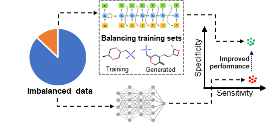

# Enhancing Classification of Imbalanced Muscarinic Receptor M1 Datasets Using Transfer Learning and Generative AI Techniques

 

## Abstract
Imbalanced data are a commonly encountered problem when building classification models from public databases. Typically, the databases contain a large fraction of active compounds as inactives are rarely reported in the literature. This imbalance can lead to skewed models with a high rate of false positives, making them unsuitable for virtual screening of chemical databases. Using the muscarinic receptor M1 as a case study, we investigated two strategies to balance public bioactivity datasets: 1) transfer learning, i.e., building a classification model on a larger corpus of related data and transferring the parameters, and 2) generating inactive compounds using generative models trained on the source data. We found that these approaches reduced misclassification of the inactive class, increasing the specificity from 0.37 to 0.68 for a scaffold-split-generated test set and from 0.07 to 0.60 for a public high-throughput screening test set. We also showed that improving the diversity of the generated compounds improves M1 models. Thus, we not only developed a robust classification model to screen chemicals against M1, but also propose a general framework for treating imbalanced data that may be translated across other targets, allowing us to build better classification models. 

## Contents
This repository contains the data, scripts, and models used in this study. They are sorted into 3 major sections:
  +	Data folder containing all the data used in this study. It is divided into 4 sub-sections.
    - Input: Contains the M1 bioactivities from ChEMBL and BindingDB, a combined public dataset and the list of compounds generated by recurrent neural network (RNN) and data-efficient grammar (DEG)
    - Training: Contains different files used for training the model. Deep neural network (DNN) models uses Morgan fingerprints for training, and are labelled as “_FP”
    - Test: Contains the scaffold-split based, high-throughput screening (HTS) and DrugBank datasets. Same naming conventions are followed as in Training
    - Results: Contains a sample results file generated from the scripts

  +	Scripts folder containing three python scripts that can be run with python script.py
    -	curate_data.py that combines data from public databases and create the training and scaffold-split-based test sets
    -	add_gen.py that augments the RNN/DEG generated inactives with the training set
    -	pred_sklearn.py that runs the NB, RF and XG models
    -	pred_dnn_w_transfer_learning.py that runs the regular DNN along with transfer learning

+	Model folder containing the Naïve Bayes, Random forest, XGBoost and the various DNN models

## Setting up the anaconda environment
To run the python script, you will first need Anaconda installed. From an Anaconda prompt, set up a new environment using the following commands:

conda create -n imbalanced_m1 python=3.9

conda activate imbalanced_m1

Next, navigate to this repository's folder and enter the following command to install dependencies:

pip install -r requirements.txt

## Running the scripts

### Combining data and creating training and test sets
python curate_data.py 

### Running the NB/RF/XG models
python pred_sklearn.py

### Running the DNN and transfer learning models
python pred_dnn_w_transfer_learning.py
: 
